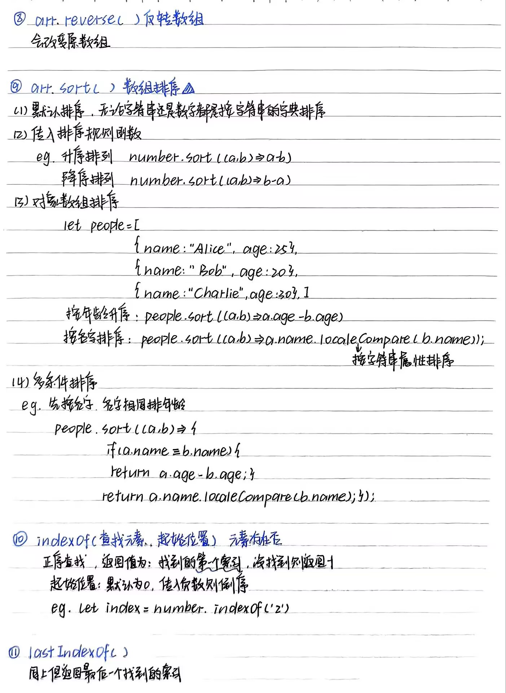

# Web前端

# 一、HTML

## 标签

### HTML常用标签

####  1、文档结构标签

- `<html>`：页面根标签
- `<head>`：包含元数据（标题、编码、脚本等）
- `<body>`：可见页面内容
- `<header>`：页面或区块的头部
- `<nav>`：导航链接
- `<main>`：主要内容区（HTML5 新增）
- `<footer>`：页面或区块的底部

####  2、文本格式标签

- `<h1>`~`<h6>`：标题（h1 最高级）
- `<p>`：段落
- `<b>`：粗体（无语义）
- `<strong>`：强调（语义化粗体）
- `<i>`：斜体（无语义）
- `<em>`：强调（语义化斜体）
- `<u>`：下划线
- `<del>`：删除线
- `<ins>`：插入内容
- `<sub>`：下标
- `<sup>`：上标

#### 3、列表标签

- `<ul>`：无序列表
- `<ol>`：有序列表
- `<li>`：列表项
- `<dl>`、`<dt>`、`<dd>`：定义列表（术语和描述）


#### 4、链接与媒体标签

- `<a>`：超链接
- ``：图像
- `<audio>`：音频（HTML5 新增）
- `<video>`：视频（HTML5 新增）
- `<source>`：多格式媒体源（HTML5 新增）
- `<embed>`：外部内容嵌入
- `<iframe>`：内联框架


#### 5、表单标签

- `<form>`：表单容器
- `<input>`：输入字段（type 属性决定类型）
- `<textarea>`：多行文本框
- `<select>`、`<option>`：下拉菜单
- `<button>`：按钮
- `<label>`：表单元素标签
- `<fieldset>`、`<legend>`：表单分组
- `<datalist>`：输入建议（HTML5 新增）
- `<keygen>`：密钥生成（HTML5 新增，已弃用）
- `<output>`：计算结果（HTML5 新增）


#### 6、表格标签

- `<table>`：表格
- `<tr>`：表格行
- `<td>`：表格单元格
- `<th>`：表头单元格
- `<thead>`、`<tbody>`、`<tfoot>`：表格分区
- `<caption>`：表格标题
- `<col>`、`<colgroup>`：列定义

- [ ] #### 7.语义化标签（HTML5 新增）

- `<article>`：独立内容（如博客文章）
- `<section>`：文档章节
- `<aside>`：侧边栏或附属内容
- `<figcaption>`、`<figure>`：图文组合
- `<mark>`：高亮文本
- `<time>`：日期 / 时间（HTML5 新增）
- `<wbr>`：可选换行（HTML5 新增）

元素语义化：选择具有明确含义的标签来结构化内容，使标签本身能够清晰地表达内容的功能、用途或逻辑意义

# 二、CSS

## （1）CSS样式

#### 1、按样式位置分类（按优先级排）

- 行内样式
- 内部样式
- 外部样式

#### 2、按布局和功能分类

1. ##### 盒模型相关样式

- 相关样式属性如 width （元素宽度）、 height （元素高度）、 padding （内边距）、 border （边框样式、宽度、颜色 ）、 margin （外边距 ） 

2. ##### Flex布局样式（Flexbox）

3. ##### Grid布局样式

4. ##### 定位样式

- 静态定位（static）：默认方式，按正常文档流排列
- 相对定位（relative）：元素在正常文档流中**占据空间**，再相对于自身原来位置进行偏移 
- 绝对定位（absolute）：**脱标**，相对上级定位元素
- 固定定位（fixed）：**脱标**，相对于**浏览器窗口**进行固定定位 

##    (2)  如何拿到元素

标签选择器：如，p可选出所有<p>

类选择器：可以复用

ID选择器：id与元素一一对应

伪类选择器

- [ ] 后代选择器

- [ ] 子元素选择

- [ ] ## （3）CSS具备的方案

- CSS Module 方案：表面体现形式： xxx.module.css
- CSS 预处理器的使用： less sass 的工程化使用
- CSSInJs 实现方案：styled-component 主要是在 react 中有大量的使用
- CSS 原子化方案：tailwindcss unocss 
- CSS Scoped: CSS作用域，主要在 vue 中有一定的体现

# 三 .JS

## (1)  JS中具备的数据类型

#### 基本数据类型

- 数值（Number）：包括整数和浮点数，还有特殊值 Infinity （无穷大）、 -Infinity （负无穷大）和 NaN （非数值）。

- 字符串（String）：由零个或多个字符组成的序列，用单引号或双引号包裹。

- 布尔值（Boolean）：true 和 false，用于逻辑判断。

- 空值（Null）：空对象指针，只有 null 一个值。

- 未定义（Undefined）：当变量声明但未赋值时，其值为 undefined 。

- 符号（Symbol）：ES6引入的新类型，通过 Symbol() 函数创建，每个符号都是唯一的，可用于对象属性的键，防止属性名冲突。

#### 引用数据类型

- 对象（Object）：是属性的集合，属性可以是基本数据类型或其他对象，如 {name: 'John', age: 30} 。

- 数组（Array）：一种特殊的对象，用于存储有序的数据集合，如 [1, 2, 3] 。

- 函数（Function）：可被调用执行的代码块，也是对象，具有属性和方法。

## （2）map 和 object 之间的区别

| **特性**     | **Object**                                      | **Map**                          |
| ------------ | ----------------------------------------------- | -------------------------------- |
| **键的类型** | 字符串或 Symbol                                 | 任意类型（包括对象、函数等）     |
| **键的顺序** | 不保证（ES6+ 按插入顺序排列字符串键，但非强制） | 严格按插入顺序排列               |
| **默认键**   | 原型链上的属性可能冲突（如 `toString`）         | 无默认键                         |
| **大小计算** | 需手动计算（如 `Object.keys(obj).length`）      | 直接通过 `size` 属性获取         |
| **迭代**     | 需手动转换为数组（如 `Object.entries()`）       | 直接支持 `for...of`、`forEach`   |
| **性能**     | 适合少量键值对，查找效率略低                    | 适合大量键值对，增删改查性能更优 |
| **序列化**   | 支持 `JSON.stringify()`                         | 默认不支持，需手动转换           |

## （3）javascript 原型链

[JavaScript原型链 - Web前端工程师面试题讲解](https://www.bilibili.com/video/BV1N7411k7D2?spm_id_from=333.788.videopod.sections&vd_source=0068c85dc70ee23b97ca024f79dca360)

## （4）javascript 中有哪些作用域

**1.全局作用域**

- **定义**：在所有函数和代码块外部定义的变量和函数属于全局作用域。
- **生命周期**：页面加载时创建，页面关闭时销毁。
- **可见性**：在代码的任何位置都可访问。

**2.函数作用域**

- **定义**：在函数内部定义的变量和函数只能在该函数内部访问。
- **生命周期**：函数调用时创建，函数执行结束后销毁。
- **可见性**：函数内部可访问，外部无法访问。

**3.块级作用域**

- **定义**：使用 `let` 和 `const` 在 `{}` 代码块（如 `if`, `for`, `while`）中声明的变量，只能在该代码块内访问。
- **生命周期**：代码块执行时创建，执行结束后销毁。
- **可见性**：仅在代码块内部可见。

## （5）javascript 为什么是单线程的

作为脚本语言更适应响应式

## （6） javascript 的异步处理机制

JavaScript 是**单线程**的，意味着同一时间只能执行一个任务。若没有异步机制，耗时操作（如网络请求）会阻塞主线程，导致页面卡顿或无响应

#### 异步实现:

回调函数

promise

async/await

生成器

#### 事件的执行顺序：


## （7）javascript 中的Promise


**手写promise：**

```js
 class myPromise { //创建一个类来模拟原生promise的实例化
      constructor(executor) { //js类通过constructor传参
        this.state = 'pending' //加入状态机制，初始化为pending
        this.result = null; //保存成功回调的值
        this.reason = null; //保存失败的原因
        this.onFulfilledCallbacks = [];
        this.onRejectedCallbacks = [];
        //当state还是pending时先将成功与失败的两个回调函数储存起来稍后执行（这里储存在两个数组中）
        try { //回调函数也要设置捕获异常
          executor(this.resolve.bind(this), this.reject.bind(this));
          //回调函数接收两个参数，对应成功回调和失败回调
          //先通过bind使this指向myPromise（executor中没有this）
          //再通过this.resolve、this.reject指向下面定义的两个方法
        } catch (error) {
          this.reject(error)
        }
      }

      resolve(result) {
        if (this.state === 'pending') {
          this.state = 'fulfilled'; //经过resolve，状态变为完成态
          this.result = result; //将this.result的值更新，实现链式调用
          this.onFulfilledCallbacks.foreach(callbacks => {
            //遍历保存回调函数的数组，返回用callback处理的结果
            callbacks(result);
          })
        }
      }
      reject(reason) {
        if (this.state === 'pending') {
          this.state = 'rejected'; //经过reject，状态变为被拒绝
          this.reason = reason;
          this.onRejectedCallbacks.forEach(callbacks => {
            callbacks(reason);
          })
        }
      }

      then(onFulfilled, onRejected) { //创建then方法接收两个参数，对应成功回调和失败回调
        let promise2 = new myPromise((resolve, reject) => { //让then方法可以再返回一个promise实现链式调用
          /*onFulfilled = typeof onFulfilled === 'function' ? onFulfilled : value => value;
          onRejected = typeof onRejected === 'function' ? onRejected : reason => {
            throw reason;
          } //判断传入参数是否为函数，不是就直接返回值*/
          if (this.state === 'fulfilled') { //通过状态机制来决定执行哪一个（由上一步取得状态机制）
            setTimeout(() => {
              try { //用tyr catch来捕获异常
                if (typeof onFulfilled !== 'function') {
                  resolve(this.result); //判断回调函数是否为函数类型，不是就直接返回
                } else {
                  let x = onFulfilled(this.result); //将上一步的结果作为参数传入，实现链式调用
                  resolvePromise(promise2, x, resolve, reject);
                  //封装一个函数来解决then的返回值有多种，将x与promise2做比对
                }
              } catch (e) {
                reject(e);
              }
            }) //需要状态变更后再执行，即异步执行

          } else if (this.state === 'rejected') {
            setTimeout(() => {
              try {
                if (typeof onRejected !== 'function') {
                  resolve(this.reason); //判断回调函数是否为函数类型，不是就直接返回
                } else {
                  let x = onRejected(this.reason);
                  resolvePromise(promise2, x, resolve, reject);
                }
              } catch (e) {
                reject(e);

              }
            });
          } else if (this.state === 'pending') { //回调函数和then都是异步执行，可能状态还是pending
            this.onFulfilledCallbacks.push(() => {
              //此时数组为空用push相当于直接将下面的回调函数添加到数组中
              setTimeout(() => {
                try {
                  if (typeof onRejected !== 'function') {
                    resolve(this.reason); //判断回调函数是否为函数类型，不是就直接返回
                  } else {
                    let x = onFulfilled(this.result);
                    resolvePromise(promise2, x, resolve, reject);
                  }
                } catch (e) {
                  reject(e);
                }
              })
            })
            this.onRejectedCallbacks.push(() => {

              setTimeout(() => {
                try {
                  if (typeof onRejected !== 'function') {
                    resolve(this.reason); //判断回调函数是否为函数类型，不是就直接返回
                  } else {
                    onRejected(this.reason);
                    resolvePromise(promise2, x, resolve, reject);
                  }
                } catch (e) {
                  reject(e);
                }
              })
            })
          }
        })
        return promise2; //返回新的promise
      }
    }
    function resolvePromise(promise2, x, resolve, reject) {
      if (x === promise2) {
        throw new TypeError('promise error');
      }
      if (x instanceof myPromise) { //检测x与promise是否指向同一个对象造成死循环
        x.then(y => {
          //判断x是不是符合A+规范promise，如果是就在then中拿到返回值
          // 但返回值依旧可能是一个promise对象，所以再次传入resolvePromise进行递归处理
          resolvePromise(promise2, y, resolve, reject)
        }, reject);
      }
      //判断x是否为符合其他规范的promise，
      else if (x !== null && ((typeof x === 'object' || (typeof x === 'function')))) {
        try {
          let then = x.then;
        } catch (e) {
          return reject(e);
        }
        if (typeof then === 'function') {
          try {
            then.call(
              x,
              y => {
                if (called) return;
                called = true;
                resolvePromise(promise, y, resolve, reject);
              },
              r => {
                if (called) return;
                called = true;
                reject(r);
              }
            )
          } catch (e) {
            if (called) return;
            called = true;
            return reject(e)
          }
        } else {
          resolve(x);
        }
      } else {
        return resolve(x);
      }
    }

```

## (8)  javascript 中的防抖节流


## (9)  javascript 函数柯里化的实现


## (10)  javascript 组合函数的实现


## (11)javascript 管道函数的实现


## (12)javascript 深拷贝和浅拷贝以及闭包的知识

**深拷贝，浅拷贝：**


**闭包：**


## （13）javascript 中的常用的 Array 的 API





## （14） javascript 中的常用的 Object 的 API

1. ```js
	Object.create(proto[, propertiesObject])
	```

	创建一个新对象，继承指定原型对象的属性。

	```js
	const person = {  greet() {    return `Hello, ${this.name}`;  } }; const alice = Object.create(person); alice.name = 'Alice'; console.log(alice.greet()); // "Hello, Alice"
	```
	
	
	
2. ```
	Object.assign(target, ...sources)
	```

	将一个或多个源对象的所有可枚举属性复制到目标对象（浅拷贝）。

	```js
	const target = { a: 1 };
	const source = { b: 2 };
	const merged = Object.assign(target, source);
	console.log(merged); // { a: 1, b: 2 }
	```
	
	
	
3. ```
	Object.defineProperty(obj, prop, descriptor)
	```

	直接在对象上定义一个新属性，或修改现有属性，并返回该对象。

	```js
	const obj = {};
	Object.defineProperty(obj, 'name', {
	  value: 'John',
	  writable: false, // 不可修改
	  enumerable: false, // 不可枚举
	  configurable: false // 不可删除或重新配置
	});
	```
	
	
	
4. ```
	Object.defineProperties(obj, props)
	```

	一次性定义多个属性
	
	```js
	Object.defineProperties(obj, {
	  age: { value: 30, writable: true },
	  gender: { value: 'male', enumerable: false }
	});
	```
	
	
	
5. ```
	Object.keys(obj)
	```

	返回一个由对象的可枚举属性组成的数组（仅包含自身属性，不包含原型链属性）。

	```js
	const user = { name: 'Alice', age: 25 };
	console.log(Object.keys(user)); // ['name', 'age']
	```

6. ```
	Object.values(obj)
	```

	返回对象的所有可枚举属性值组成的数组。

	```js
	console.log(Object.values(user)); // ['Alice', 25]
	```

7.

```
Object.entries(obj)
```

返回对象的所有可枚举属性的键值对数组。

```js
console.log(Object.entries(user)); // [['name', 'Alice'], ['age', 25]]
```

8.

```
Object.getOwnPropertyDescriptor(obj, prop)
```

返回指定属性的描述符。

```js
const descriptor = Object.getOwnPropertyDescriptor(user, 'name');
// { value: 'Alice', writable: true, enumerable: true, configurable: true }
```

9.

```
 Object.prototype.hasOwnProperty(prop)
```

检查对象自身是否具有指定属性（不包括原型链属性）。

```js
console.log(user.hasOwnProperty('name')); // true
console.log(user.hasOwnProperty('toString')); // false
```

10.

```
Object.is(value1, value2)
```

比较两个值是否相同（比 `===` 更严格，能正确处理 `NaN` 和 `-0`）

```js
console.log(Object.is(NaN, NaN)); // true
console.log(Object.is(0, -0)); // false
```

11.

```
Object.getPrototypeOf(obj)
```

返回对象的原型。

12.

```js
console.log(Object.getPrototypeOf(user) === Object.prototype); // true
```

扩展运算符（Spread Operator）

```js
const clone = { ...user };
```

13.

```
 Object.freeze(obj)
```

冻结对象，使其不可修改（属性不可添加、删除或修改）

```js
const frozen = Object.freeze({ a: 1 });
frozen.a = 2; // 无效（严格模式下报错）
```

15.

```
Object.seal(obj)
```

密封对象，使其不可添加新属性，但可修改现有属性。

```js
const sealed = Object.seal({ a: 1 });
sealed.a = 2; // 有效
sealed.b = 3; // 无效（严格模式下报错）
```

## (15) DOM


## (16) BOM


# 四、REACT

### 关于react：

#### 1. **JSX（JavaScript XML）**

- **特点**：JSX 是 JavaScript 的语法扩展，允许在 JavaScript 代码中编写类似 XML 的结构，提高代码可读性。
- **转换**：JSX 会被 Babel 编译为 `React.createElement()` 调用。

#### 2. **虚拟 DOM（Virtual DOM）**

- **概念**：轻量级的 JavaScript 对象，是真实 DOM 的抽象表示。

- 工作原理

	：

	1. 每次状态更新时，React 生成新的虚拟 DOM 树。
	2. 通过 Diff 算法对比新旧虚拟 DOM 的差异。
	3. 仅将需要的最小变更应用到真实 DOM。

#### 3. **单向数据流（One-Way Data Flow）**

- **数据流动**：数据流动是单向的，从上到下（父组件 → 子组件）。
- **优点**：数据流向清晰，易于理解和调试。

#### 4. **组件化（Components）**

- **分类**：函数组件（无状态）和类组件（有状态）。

- 特性

	：

	- 可复用性：组件可在多个地方使用。
	- 独立封装：组件内部逻辑与外部隔离。

#### 5. **状态管理（State）**

- **局部状态**：组件内部维护的状态（`this.state` 或 `useState`）。
- **全局状态**：通过 Redux、Context API 或 MobX 管理跨组件状态。

#### 6. **生命周期方法（Lifecycle Methods）**

- **类组件专属**：如 `componentDidMount`、`render`、`componentWillUnmount` 等。
- **函数组件**：使用 `useEffect` 替代部分生命周期功能。

### Fiber 架构（React 16+）

#### 1. **核心目标**

- **解决主线程阻塞**：将渲染任务拆分为多个小任务，允许中断和恢复，避免长时间阻塞 UI 渲染。
- **优先级调度**：为不同类型的更新分配不同优先级，高优先级任务（如动画）可插队执行。

#### 2. **Fiber 树的特点**

- **链表结构**：Fiber 节点通过 `child`、`sibling`、`return` 指针形成链表，替代传统的递归调用栈。
- **可中断渲染**：渲染过程可分为多个阶段，每个阶段完成后可暂停，将控制权交回主线程。
- **双缓存机制**：维护两棵 Fiber 树（`current` 和 `workInProgress`），切换时只需修改根指针，提高性能。

#### 3. **渲染流程**

1. 协调阶段（Reconciliation）

	：

	- 可中断：执行 Diff 算法，生成新的 Fiber 树。
	- 异步执行：根据优先级调度任务。

2. 提交阶段（Commit）

	：

	- 不可中断：将协调阶段的结果一次性应用到真实 DOM。
	- 同步执行：确保 UI 一致性。

### React 16 前后的主要变化

#### 1. **架构层面**

- **React 15**：基于栈的协调器（Stack Reconciler），递归处理虚拟 DOM，无法中断。
- **React 16+**：Fiber 协调器（Fiber Reconciler），支持异步渲染、任务中断和优先级调度。

#### 2. **API 变化**

- 新增 API

	：

	- `useState`、`useEffect` 等 Hooks（React 16.8+），替代类组件的状态管理。
	- `React.memo`：高阶组件，用于函数组件的浅比较优化。
	- `React.lazy` 和 `Suspense`：实现组件懒加载。

- 废弃 / 重命名的 API

	：

	- 生命周期方法：`componentWillMount`、`componentWillReceiveProps`、`componentWillUpdate` 被标记为不安全，推荐使用 `getDerivedStateFromProps` 和 `getSnapshotBeforeUpdate`。

#### 3. **错误处理**

- 新增 `Error Boundaries`

	：捕获子组件树中的 JavaScript 错误，并显示降级 UI。

	```jsx
	class ErrorBoundary extends React.Component {
	  state = { hasError: false };
	  static getDerivedStateFromError(error) {
	    return { hasError: true };
	  }
	  componentDidCatch(error, errorInfo) {
	    // 记录错误日志
	    console.log(error, errorInfo);
	  }
	  render() {
	    if (this.state.hasError) {
	      return <div>Something went wrong.</div>;
	    }
	    return this.props.children;
	  }
	}
	```

#### 4. **组件返回值**

- 支持多节点返回

	：可返回数组或 Fragment（），替代单个根节点。

	```jsx
	return (
	  <>
	    <ChildA />
	    <ChildB />
	  </>
	);
	```

#### 5. **性能优化**

- **异步渲染**：Fiber 架构允许渲染过程分片，提高动画、交互的流畅度。
- **时间切片（Time Slicing）**：低优先级任务可在浏览器空闲时执行。

#### 6. **其他特性**

- Portals

	：允许渲染子组件到父组件 DOM 层级之外的位置。

	```jsx
	ReactDOM.createPortal(child, container);
	```

	

- Context API

	：简化跨层级数据传递，减少

	```
	props drilling
	```

	```jsx
	const MyContext = React.createContext(defaultValue);
	```

	

- - 

## (1) JSX

**1.大括号语法{ }** 识别js中的表达式，如变量、函数调用、方法调用

- 引号传字符串 {'this is A'}
- js变量 {count}
- 函数 {getName()}
- 方法调用 {new Date(),getDate()}
- js对象 {{color:''red}}

#### 2.常用：map方法遍历渲染列表

```jsx
const list=[{id:1001,name:'vue'},
           {id:1002,name:'react'}]
//函数组件
function App(){      //1.渲染列表list
    return(          //2.在map结构中写入循环结构
    <ul>             //3.加上一个独一无二的key，或者id。key用于React内部使用
        {list.map(item=><li key={item.id}>{item.name}</li>)}
     </ul>
    )
}
```

**3.常用：JSX条件渲染**

逻辑运算符，

```jsx
{flag&&<span>this is span</span>}
```

三元运算符，

```jsx
{loading?<span>A</span>:<span>B</span>}
```

复杂条件渲染，

```jsx
//定义渲染函数
function getA(){
    if(A===0){
        return<div>0</div> }
    else if(A===1){
        return<div>1</div>  }
    else{
        return <div>1000</div>
}
    
//实现渲染
    function App(){
        return(
        <div id='App'>
            {getA()}
         </div>
        )
    }
```

## (2)react事件绑定

```jsx
//写在函数组件中
const handleClick=()=>{console.log('点了')} //可传：事件参数（e）、自定义参数（a）、同时传入（a，e）

return(
<div className="App">
    <button onClick={(e)=>handleClick('jack',e)}> click me</button> /*绑定点击事件*/
</div>
)

```

### **1. 基本 DOM 事件**

**点击事件**：`onClick`, `onDoubleClick`

**焦点事件**：`onFocus`, `onBlur`

**表单事件**：`onChange`, `onSubmit`, `onReset`

**键盘事件：** 

**`onKeyDown`**

按下键盘任意键

```jsx
 <input onKeyDown={(e) => {  if (e.key === 'Enter') submitForm(); }} />  
```

**`onKeyUp`** 释放键盘按键

**鼠标事件：**

  `onMouseDown` ：当标按键按下时触发。常用于实现拖拽、选中开始等功能。例如在一个可拖拽的组件中，按下鼠标开始记录起始位置：

```jsx
import React, { useState } from'react';

const DraggableComponent = () => {
  const [x, setX] = useState(0);
  const [y, setY] = useState(0);
  const [isDragging, setIsDragging] = useState(false);

  const handleMouseDown = (e) => {
    setIsDragging(true);
    setX(e.clientX);
    setY(e.clientY);
  };

  return (
    <div
      style={{ width: '100px', height: '100px', background: 'blue' }}
      onMouseDown={handleMouseDown}
    >
      {isDragging? '正在拖拽' : '点击开始拖拽'}
    </div>
  );
};

export default DraggableComponent;

```

**`onMouseMove`** ：鼠标在元素上移动时持续触发。结合 onMouseDown 可实现鼠标***`拖拽功能`***，在鼠标移动过程中**`实时更新元素位置`**。

**`onMouseUp`** ：当鼠标按键在元素上松开时触发。与 onMouseDown  配合，完成拖拽、点击等操作的完整逻辑，比如**`拖拽结束时更新元素位置`**。

**`onMouseEnter`** ：鼠标指针进入元素范围时触发，仅会触发一次，不会在子元素上冒泡。可用于实现元素进入时的提示、样式变化等效果，如鼠标移入按钮时按钮变色。

**`onMouseLeave`** ：鼠标指针离开元素范围时触发，仅会触发一次，不会在子元素上冒泡。常与 onMouseEnter  配合，实现**`鼠标进出元素时的交互效果切换`**。

**`onMouseOver`** ：鼠标指针进入元素及其子元素范围时触发，会发生冒泡。与 onMouseEnter  功能类似，但由于冒泡特性，在有多层嵌套元素时触发情况不同。

**`onMouseOut`** ：鼠标指针离开元素及其子元素范围时触发，会发生冒泡。与 onMouseLeave  相对应，因冒泡特性存在差异。

**表单事件：**

**`onChange`** ：在表单元素（如 &lt; input &gt; 、 &lt;textarea&gt; 、 &lt;select&gt;  等 ）值发生变化时触发。用于实时获取用户输入内容并更新组件状态，使表单元素成为受控组件，如在文本输入框中实时获取用户输入：

```jsx
import React, { useState } from'react';

const InputExample = () => {
  const [inputValue, setInputValue] = useState('');
  const handleChange = (e) => {
    setInputValue(e.target.value);
  };

  return (
    <input type="text" value={inputValue} onChange={handleChange} />
  );
};

export default InputExample;

```

**`onBlur`** ：表单元素失去焦点时触发。常用于表单验证，在用户输入结束、离开输入框时检查输入内容是否符合规则。

**`onFocus`** ：表单元素获得焦点时触发。可用于显示提示信息、激活相关功能等，比如输入框获得焦点时显示清除按钮。

**`onSubmit`** ：在表单提交时触发，常用于处理表单数据提交逻辑，如将用户输入的数据发送到服务器。

**触摸事件**：`onTouchStart`, `onTouchMove`, `onTouchEnd`

**拖拽事件**：`onDrag`, `onDragEnd`, `onDragStart`, `onDrop`

**滚动事件**：`onScroll`

**选择事件**：`onSelect`

### 2. 特殊事件**

**剪贴板事件**：`onCopy`, `onCut`, `onPaste`

**输入事件**：`onInput`

**加载事件**：`onLoad`, `onError`

**上下文菜单事件**：`onContextMenu`

**动画事件**：`onAnimationStart`, `onAnimationEnd`, `onAnimationIteration`

**过渡事件**：`onTransitionEnd`


## （3） react 组件通信


## （4）react中常用hook


## （5）react优化页面

- **useMemo** 在组件每次重新渲染到时候缓存计算结果
- **React.memo** 允许组件在props没有改变的情况下跳过渲染，防止每一次父组件更新就让子组件也重新渲染造成浪费
- **useCallback** 在组件多次重新渲染到时候缓存函数

## （6）react路由


## （7）react组件设计层面思考

## （8）react生命周期是怎样的？它是怎么演变而来的

## （9）react中是怎么进行状态管理的，本地的是咋样的，全局呢？

## （10）react中class组件vs函数式组件

## （11）为什么许多语言所倡导的类在react中会被函数式组件所取代呢

## （12）React 中的调度器为什么没有使用浏览器内置的 requestIdleCallback，而是重写的一套调度器实现

# 五、网络请求

## (1)网络请求

- **GET**
- - 特点：用于获取资源，是幂等的，即多次请求相同的URL，结果相同，且请求参数会显示在URL中，有长度限制，安全性相对较低，因为参数容易被篡改。

	- 应用场景：一般用于获取数据，如在搜索引擎中输入关键词搜索，就是通过GET请求向服务器获取相关搜索结果。

- **POST**
- - 特点：用于提交数据，不是幂等的，数据通过请求体传递，不会显示在URL中，对数据长度无限制，安全性相对较高，适合提交敏感信息，如用户登录时的用户名和密码。

	- 应用场景：常用于表单提交，如注册账号、发表评论等操作，将用户输入的数据提交到服务器进行处理。

- **PUT**
- - 特点：用于更新资源，是幂等的，通过请求体传递数据，可指定要更新的资源的完整状态，若资源不存在则可创建新资源。

	- 应用场景：比如更新用户的个人信息，可通过PUT请求将新的信息发送到服务器，服务器根据请求中的数据对相应资源进行更新。

- **DELETE**
- - 特点：用于删除资源，是幂等的，通常通过在URL中指定要删除的资源的标识符来告诉服务器删除相应资源。

	- 应用场景：当用户删除自己发布的文章或照片时，就会向服务器发送DELETE请求，服务器根据请求中的信息删除对应的资源。

## (2)状态码

HTTP状态码通常分为以下几类：

**1xx 信息性状态码**

- **100 Continue**：表明服务器已收到请求的第一部分，客户端可以继续发送剩余部分。

**2xx 成功状态码**

- **200 OK**：表示请求成功，服务器已成功处理请求并返回相应数据。

- **201 Created**：用于创建资源的请求，表明资源已成功创建。

**3xx 重定向状态码**

- **301 Moved Permanently**：表示请求的资源已被永久移动到新的URL。

- **302 Found**：表示请求的资源临时移动到新的URL。

**4xx 客户端错误状态码**

- **400 Bad Request**：表示客户端发送的请求有误，服务器无法理解。

- **401 Unauthorized**：表示客户端未进行身份验证或身份验证失败。

- **403 Forbidden**：表示服务器理解请求，但拒绝执行，通常是因为权限不足。

- **404 Not Found**：表示服务器找不到请求的资源。

**5xx 服务器错误状态码**

- **500 Internal Server Error**：表示服务器内部发生错误，无法完成请求。
- **503 Service Unavailable**：表示服务器暂时无法处理请求，通常是因为服务器过载或正在维护。

## (3)网络请求方案*

tipe：在调试工具network进行检测

### **原生AJAX**

```js
//原生AJAX（通过XMLHttpRequest对象进行生成）
const xhr=new XMLHttpRequest() //后续通过xhr的方法帮助我们进行请求

//以下为get请求
xhr.open('GET','https://www.httpbin.org/get?name=小美') //第二个参数为请求公司的地址+末尾get，后面可添加请求参数
xhr.send() //通过send将请求发送
//方式一，通过onreadystatechange事件进行接受
xhr.onreadystatechange=function(){
  if(xhr.readyState===XMLHttpRequest.DONE&&xhr.status===200){  //判断是否完成请求或状态码等于200
      console.log( JSON.parse(xhr.responseText)) //正常返回值为字符串，用JSON方法转化为字符串
     }
   
}

//以下为post请求
xhr.open('POST','https://www.httpbin.org/post') //第二个参数为请求公司的地址+末尾post,不可加参数
xhr.setRequestHeader('Content-Type','application/x-www-form-urlencoded') //设置请求头，send中可发送各种各样的参数，通过这个提前高速后台参数格式
xhr.send('name=lily') //在send中写参数
xhr.onreadystatechange=function(){
  if(xhr.readyState===XMLHttpRequest.DONE&&xhr.status===200){  //判断是否完成请求或状态码等于200
      console.log( JSON.parse(xhr.responseText)) //正常返回值为字符串，用JSON方法转化为字符串
     }
   
}

```

### **Axois**

**引入：**

- 通过node方式

- ```bash
	# 使用npm安装
	npm install axios
	
	# 或者使用yarn安装
	yarn add axios
	```

- 或CDN方式

- ```js
	<script src="https://cdn.jsdelivr.net/npm/axios/dist/axios.min.js"></script>
	```

- 当然也可以直接下载文件

示例：

```js
//axios（axios本身是封装好的，可以直接进行get或post请求
//如：axios.get('https://www.httpbin.org/get')

//使用then或async进行成功处理
(async()=>{

  //get请求
  const res=await axios.get('https://www.httpbin.org/get',{
    parama:{     //传递请求参数
      name:'旺仔',
      says:'miaow'
    }
  })

  //post请求
   const res2=await axios.post('https://www.httpbin.org/post',{
    //传递请求参数，不再需要parama
      name:'旺仔',
      says:'八嘎'
     })

  //基地址配置（就不用自己再去做拼接啦）
  const ins=axios.create({
    baseURL:'https://www.httpbin.org'
  })
   const res3=await ins.post('/post',{
      name:'旺仔',
      says:'woof'
     })

//拦截器
//1.请求拦截器
ins.interceptors.request.use(config=>{
 console.log('发送了请求')  //这里可以将拦截下来的请求做一些处理
  return config  //将请求发送
})
//2.响应拦截器
ins.interceptors.response.use(res=>{
console.log('得到了响应')
return res
})

  console.log(res.data)
  console.log(res2.data)
  console.log(res3.data)
})()
```


### Fetch API

```js
//Fetch API

//1.then
//get请求
fetch('https://www.httpbin.org/get?name=旺仔')  //fetch函数，默认是get请求方式
.then(res=>{  //用then来处理promise
if(res.ok){
  return res.json()  //将res转化为对象形式
}
})
.then(data=>{
  console.log(data)
})

//post1请求
fetch('https://www.httpbin.org/post',{ //post不直接传参
  methed:'POST',
  header:{  //请求头设置
    'Content-Type':'application/json'
  },
  body:JSON.stringify({
    name:'旺仔',
    says:'miaow'
  })
}) 
.then(res=>{  //用then来处理promise
if(res.ok){
  return res.json()  //将res转化为对象形式
}
})
.then(data=>{
  console.log(data)
})

```

**使用async await优化fetch！！！**

```js
// 创建一个异步函数来封装网络请求和数据处理逻辑
let applyNet = async () => {
    // 定义基础URL
    const url = 'https://www.httpbin.org/get';
    try {
        // 使用Promise.all并发发起一个fetch请求（这里只有一个请求，也可扩展为多个）
        // await会等待所有Promise（这里是fetch请求返回的Promise）都完成
        let responses = await Promise.all([fetch(`${url}`)]);
        // 遍历响应数组，对每个响应调用json()方法将响应体解析为JSON格式
        // 这里得到的是一个Promise数组，每个Promise会在解析完成后返回JSON数据
        let jsons = responses.map(response => response.json());
        // 再次使用Promise.all等待所有解析JSON的Promise完成
        // 完成后values数组会包含所有解析后的JSON数据
        let values = await Promise.all(jsons);
        // 遍历解析后的JSON数据数组
        values.map(value => {
            // 打印每个JSON数据对象（这里先不考虑数据结构中是否真的有data字段）
            console.log(value);
        });
    } catch (error) {
        // 捕获请求或数据处理过程中发生的错误并在控制台打印错误信息
        console.error('请求或处理数据时出错:', error);
    }
};
// 调用定义好的applyNet函数来执行整个逻辑
applyNet();
```


## (4）封装一个请求


## (5)响应请求拦截器

- 概念及作用

- - 响应请求拦截器主要用于在接收到服务器响应后，对响应数据进行拦截和处理。它可以在数据传递给应用程序的最终处理逻辑之前，对响应进行修改、验证、转换等操作，有助于实现统一的错误处理、数据格式化、缓存管理等功能，提高代码的可维护性和复用性。

- 工作原理

- - 当客户端发出网络请求后，服务器返回响应数据。在数据到达客户端应用程序的具体处理代码之前，响应请求拦截器会先拦截到该响应。拦截器可以检查响应的状态码、响应头信息以及响应体数据等。根据预设的规则和逻辑，对响应进行相应的处理，比如当响应状态码表示错误时，拦截器可以统一进行错误提示；或者对响应体中的数据进行格式转换，使其更符合应用程序的使用要求。处理完成后，再将响应数据传递给后续的应用程序逻辑进行进一步处理。

- 实现方式

- - 在不同的编程框架和网络库中，响应请求拦截器的实现方式有所不同。以常见的axios库为例，它通过 axios.interceptors.response.use() 方法来添加响应拦截器。在这个方法中，可以传入两个回调函数，第一个回调函数用于处理成功的响应，第二个回调函数用于处理错误的响应。通过在这些回调函数中编写逻辑，就可以实现对响应的拦截和处理

**具体实现栗子：**

```jsx
import axios from 'axios';

// 添加响应拦截器
axios.interceptors.response.use(
    response => {
        // 对响应数据进行处理，比如打印响应数据
        console.log('响应数据:', response.data);
        return response;
    },
    error => {
        // 对错误进行处理，比如打印错误信息
        console.log('响应错误:', error.message);
        return Promise.reject(error);
    }
);
```

**应用场景**

- 错误处理：统一处理各种错误状态码，如404、500等，给用户提供友好的错误提示。

- 数据转换：将服务器返回的原始数据格式转换为更便于应用程序使用的格式。

- 缓存管理：根据响应头中的信息或特定的逻辑，判断是否需要缓存响应数据，以及如何更新缓存。

- 日志记录：记录响应的相关信息，如响应时间、响应内容等，以便于调试和性能分析。


## (6)请求过程

#### **1. 构建请求（浏览器准备阶段）**
- **触发请求**：通过代码（如 `fetch()` 或 `XMLHttpRequest`）或用户行为（点击链接、提交表单）触发请求。
- **组装请求信息**：
  - **URL**：目标地址（如 `https://httpbin.org/get`）
  - **请求方法**：GET、POST、PUT、DELETE 等
  - **请求头（Headers）**：包含浏览器类型（User-Agent）、接受的数据格式（Accept）、Cookie 等
  - **请求体（Body）**：POST/PUT 请求时携带的数据（如 JSON、表单）

#### **2. DNS解析（找到服务器地址）**
- **问题**：URL 中的域名（如 `httpbin.org`）需要转换为服务器的实际 IP 地址（如 `54.175.219.8`）。
- **过程**：
  1. 检查浏览器缓存 → 2. 检查系统缓存 → 3. 向本地 DNS 服务器查询 → 4. 递归查询直到找到 IP。
- **比喻**：就像用电话簿查找“某公司”的电话号码。

#### **3. 建立TCP连接（可靠传输的基础）**
- **三次握手**（确保双方通信能力）：
  1. 客户端 → 服务器：发送 SYN 包（请求连接）
  2. 服务器 → 客户端：返回 SYN-ACK 包（同意连接）
  3. 客户端 → 服务器：发送 ACK 包（确认连接）
- **作用**：建立可靠的双向通信通道（TCP协议保证数据顺序和完整性）。

#### **4. 发送HTTP请求（传递数据）**
- **请求报文格式**：
  ```http
  GET /get HTTP/1.1
  Host: httpbin.org
  User-Agent: Mozilla/5.0
  Accept: application/json
  ```
- **如果是HTTPS**：还会通过 TLS/SSL 加密数据（涉及证书验证、密钥交换）。

#### **5. 服务器处理（后端逻辑）**
- **接收请求**：服务器解析请求头和请求体。
- **路由处理**：根据 URL 路径（如 `/get`）匹配对应的处理逻辑。
- **生成响应**：查询数据库、调用其他服务，最终生成响应数据（如 JSON、HTML）。

#### **6. 接收响应（浏览器处理阶段）**
- **响应报文格式**：
  ```http
  HTTP/1.1 200 OK
  Content-Type: application/json
  Date: Wed, 24 May 2024 02:00:00 GMT

  {"url": "https://httpbin.org/get"}
  ```
- **关键信息**：
  - **状态码**：200（成功）、404（未找到）、500（服务器错误）等。
  - **响应头**：Content-Type（数据类型）、Cache-Control（缓存策略）等。
  - **响应体**：实际数据（JSON、HTML、图片等）。

#### **7. 处理响应（前端逻辑）**
- **解析数据**：
  - 根据 `Content-Type` 决定如何解析（如 `application/json` 调用 `response.json()`）。
- **渲染页面**：如果是 HTML，浏览器会解析并渲染。
- **执行回调**：触发 JavaScript 中的回调函数（如 `then()` 或 `async/await`）。

## (7)LocalStorage，SessionStorage和Cookie

[cookie、localStorage 和 sessionStorage的区别及应用实例 ](https://www.bilibili.com/video/BV1SL4y1i7ZL?spm_id_from=333.788.videopod.sections&vd_source=0068c85dc70ee23b97ca024f79dca360)

## (8)token

[Cookie、Session、Token究竟区别在哪？如何进行身份认证，保持用户登录状态？](https://www.bilibili.com/video/BV1ob4y1Y7Ep?spm_id_from=333.788.videopod.sections&vd_source=0068c85dc70ee23b97ca024f79dca360
		)

## (9)跨域

## (10)网络调试工具

- ### **一、基础网络连通性测试工具**

- 用于检测网络设备之间的连通性、延迟和数据传输质量。

- #### 1. **Ping**

- - **功能**：通过发送 ICMP echo 请求数据包，测试目标主机的可达性，获取往返时间（RTT）、丢包率等指标。

	- 应用场景

		：

		- 检查本地网络是否正常（如 ping 网关）。
		- 判断目标服务器是否在线（如 ping [www.baidu.com](https://www.baidu.com/)）。

	- 示例命令

		```bash
		ping -c 5 192.168.1.1  # Linux/macOS，发送5个数据包
		ping www.baidu.com     # Windows默认持续发送
		```

- #### 2. **Tracert（Linux/macOS 为 Traceroute）**

- - **功能**：追踪数据包从源主机到目标主机的路由路径，显示每一跳路由器的 IP 地址和延迟。

	- 应用场景

		：

		- 定位网络延迟或丢包的具体节点（如某段路由故障）。
		- 排查跨网段访问失败的路由问题。

	- 示例命令

		```bash
		tracert www.google.com  # Windows
		traceroute -I www.google.com  # Linux/macOS（使用ICMP协议）
		```

- ### **二、网络配置与状态查看工具**

- 用于查看网络接口、路由表、端口状态等基础配置信息。

- #### 1. **Ipconfig/Ifconfig**

- - 功能

		：

		- **Ipconfig（Windows）**：查看 / 修改网络适配器的 IP 地址、子网掩码、默认网关等配置，支持刷新 DNS 缓存（`ipconfig /flushdns`）。
		- **Ifconfig（Linux/macOS）**：查看网络接口的详细信息（如 MAC 地址、IP 地址、带宽），启用 / 禁用接口（需管理员权限）。

	- 示例命令

		```bash
		ifconfig eth0  # 查看eth0接口状态
		ipconfig /all  # Windows查看所有网络适配器详情
		```

- #### 2. **Route**

- - **功能**：查看或修改本地路由表，添加 / 删除静态路由。

	- 应用场景

		：

		- 排查多网卡环境下的路由优先级问题。
		- 手动配置特定网段的转发路径。

	- 示例命令

		```bash
		route print  # Windows查看路由表
		route add -net 192.168.2.0/24 gw 192.168.1.1  # Linux添加静态路由
		```

- #### 3. **Netstat/ss**

- - 功能

		：

		- 显示当前网络连接、端口监听状态、路由表等信息。
		- 支持过滤 TCP/UDP 连接，查看进程与端口的关联（需结合`-p`参数）。

	- 应用场景

		：

		- 检查端口是否被占用（如排查 “端口已使用” 错误）。
		- 监控网络连接状态（如 ESTABLISHED、TIME_WAIT）。

	- 示例命令

		```bash
		netstat -ano | findstr "8080"  # Windows查找占用8080端口的进程
		ss -tuln  # Linux查看所有TCP/UDP监听端口
		```

- ### **三、端口与服务调试工具**

- 用于检测目标主机的端口开放情况、服务可用性及通信协议细节。

- #### 1. **Telnet/Nc（Netcat）**

- - 功能

		：

		- **Telnet**：通过 TCP 协议连接目标端口，常用于测试 HTTP/SSH 等服务是否可达（需目标服务支持明文通信）。
		- **Nc**：更强大的网络工具，支持 TCP/UDP 协议，可用于端口扫描、数据传输、端口转发等。

	- 应用场景

		：

		- 测试服务器端口是否开放（如`telnet server_ip 80`）。
		- 用 Nc 传输文件或创建简易 TCP 服务器（如`nc -l 9999`监听端口）。

	- 示例命令

		```bash
		nc -zv 192.168.1.1 80-443  # 扫描192.168.1.1的80和443端口
		```

- #### 2. **Nmap（Network Mapper）**

- - **功能**：专业的端口扫描与网络探测工具，支持 TCP/UDP 扫描、服务版本识别、操作系统指纹识别等。

	- 应用场景

		：

		- 网络安全审计（发现开放端口及潜在漏洞）。
		- 大规模网络设备普查（如扫描局域网内所有存活主机）。

	- 示例命令

		```bash
		nmap -sS -p 1-1000 192.168.1.0/24  # 半开放扫描1-1000端口
		nmap -O 192.168.1.5  # 探测目标主机的操作系统类型
		```

- ### **四、抓包与协议分析工具**

- 用于捕获网络数据包，解析协议内容，定位深层通信问题（如协议错误、数据篡改）。

- #### 1. **Wireshark**

- - **功能**：最常用的图形化抓包工具，支持捕获并解析数百种网络协议（如 HTTP、TCP、DNS），提供过滤、统计、时序图等功能。

	- 应用场景

		：

		- 分析客户端与服务器的通信流程（如 HTTP 请求 / 响应细节）。
		- 排查加密协议问题（如 HTTPS 握手失败）。

	- 操作示例

		：

		- 选择网卡 → 开始捕获 → 使用过滤规则（如`http.host == "example.com"`）→ 分析数据包内容。

- #### 2. **Tcpdump（命令行抓包工具）**

- - **功能**：Linux/macOS 下的命令行抓包工具，支持高效捕获和过滤数据包，常配合 Wireshark 使用（将抓包文件导出为.pcap 格式后用 Wireshark 分析）。

	- 示例命令

		```bash
		tcpdump -i eth0 port 80 -w http_traffic.pcap  # 捕获eth0接口80端口的流量并保存为pcap文件
		```

- ### **五、性能测试与压力工具**

- 用于评估网络带宽、延迟、吞吐量及服务器的负载能力。

- #### 1. **Iperf/Iperf3**

- - **功能**：测量网络带宽、延迟、抖动和丢包率，支持单播 / 多播测试，客户端 - 服务器模式。

	- 应用场景

		：

		- 测试局域网内的文件传输速度（如验证网线或交换机性能）。
		- 压测广域网链路的稳定性（如 VPN 连接的带宽瓶颈）。

	- 示例命令

		：

		- 服务器端：`iperf3 -s`
		- 客户端：`iperf3 -c server_ip -t 30 -p 5201`（测试 30 秒，指定端口 5201）

- #### 2. **Apache Benchmark（AB）**

- - **功能**：HTTP 性能压测工具，模拟多并发请求，统计服务器的响应时间、吞吐量、错误率等指标。

	- 应用场景

		：

		- 测试 Web 服务器的并发处理能力（如 Nginx、Apache）。
		- 对比不同网页优化方案的性能差异（如压缩、缓存）。

	- 示例命令

		```bash
		ab -n 1000 -c 100 http://localhost/index.html  # 发起1000次请求，并发数100
		```

- ### **六、高级网络调试工具**

- 适用于复杂网络环境（如云计算、容器化架构）的调试。

- #### 1. **Wget/Curl**

- - 功能

		：

		- **Wget**：命令行下载工具，支持断点续传，常用于测试服务器文件下载速度或验证 URL 可达性。
		- **Curl**：更灵活的网络请求工具，支持 HTTP/HTTPS、FTP 等协议，可自定义请求头、Cookie、认证等参数。

	- 应用场景

		：

		- 调试 API 接口（如发送 POST 请求并查看响应）。
		- 测试 CDN 节点的内容分发情况（通过不同地区节点的 curl 请求）。

	- 示例命令

		```bash
		curl -X POST "https://api.example.com/data" -d "param=value" -H "Content-Type: application/json"
		```

- #### 2. **NsLookup/Dig**

- - **功能**：域名解析调试工具，用于查询 DNS 服务器的记录（如 A 记录、MX 记录、TXT 记录），诊断域名解析故障。

	- 应用场景

		：

		- 排查 “域名无法解析” 或 “解析结果错误” 问题。
		- 验证 DNS 配置是否正确（如 SPF、DKIM 记录）。

	- 示例命令

		```bash
		nslookup www.baidu.com 8.8.8.8  # 使用Google DNS查询百度域名
		dig @ns1.example.com mx example.com  # 指定DNS服务器查询MX记录
		```

- ### **七、移动端与浏览器调试工具**

- 针对移动设备和 Web 浏览器的网络问题调试。

- #### 1. **Chrome DevTools**

- - **功能**：Chrome 浏览器内置的开发者工具，其中 “Network” 面板可捕获浏览器的网络请求，分析资源加载耗时、请求头 / 响应体、缓存策略等。

	- 应用场景

		：

		- 优化网页加载速度（如识别慢加载的 JS/CSS 文件）。
		- 调试前端接口调用问题（如 404、500 错误）。

- #### 2. **Fiddler/Charles**

- - **功能**：代理抓包工具，支持捕获手机或电脑的 HTTP/HTTPS 流量，可修改请求 / 响应内容、模拟弱网络环境（如限速、丢包）。

	- 应用场景

		：

		- 调试移动端 App 的网络请求（通过配置代理服务器）。
		- 测试 API 在不同网络条件下的稳定性（如模拟 3G 网络延迟）。

- ### **选择工具的建议**

- 1. 按场景选择

		：

		- 基础连通性问题：优先使用 Ping、Tracert。
		- 端口与服务检测：Telnet、Nmap。
		- 协议深度分析：Wireshark、Tcpdump。
		- 性能压测：Iperf、AB。

	2. 结合操作系统

		：

		- Windows：自带 Ping、Tracert、Ipconfig、Netstat；推荐安装 Wireshark、Nmap。
		- Linux/macOS：原生支持 Ifconfig、Traceroute、Tcpdump、Nc 等工具，可通过包管理器（如 apt、brew）安装 Nmap、Iperf3。

	3. 进阶需求

		：

		- 容器化环境（如 Kubernetes）：使用`kubectl debug`或`nsenter`进入容器调试网络。
		- 云网络：利用云厂商提供的工具（如 AWS VPC Flow Logs、阿里云网络诊断）。

# 六、VUE

#  七、工具类

## 1.打包构建工具

###  vue-cli create-react-app vite 使用的底层的打包工具

- vue-cli底层使用的打包工具是webpack；
- create-react-app底层默认使用的打包工具也是webpack；
- vite使用Rollup作为底层打包工具。

### 项目中为什么使用的是 webpack 或者说 vite 打包工具

- **webpack**
- - **强大的功能和高度可配置性**：它能处理多种类型的文件，如JavaScript、CSS、图片、字体等，通过各种插件和loader可以实现代码压缩、优化、按需加载等功能，能根据项目需求进行高度定制化配置。

	- **丰富的生态系统**：拥有大量的插件和loader，社区活跃，开发者能轻松找到解决各种问题的方案，也便于进行扩展和集成其他工具。

	- **广泛的兼容性**：可以将现代的JavaScript代码转换为兼容旧浏览器的代码，确保项目在不同的浏览器环境中都能正常运行。

- **vite**
- - **快速的开发体验**：利用浏览器对ES模块的原生支持，在开发阶段实现即时的模块热更新，无需像webpack那样进行大量的编译工作，大大提高了开发效率，尤其是在大型项目中效果更明显。

	- **简洁的配置**：vite的配置相对简单，对于一些基础的项目，不需要复杂的配置即可快速上手，降低了开发门槛。

	- **高效的生产构建**：在生产环境下，vite使用Rollup进行打包，能对代码进行高效的优化和压缩，生成体积小、加载速度快的生产代码。

### 常用打包工具

我只知道webpack和vite呜呜呜

- Turbopack rspack esbuild rollup tsup gulp

### 脚手架的开发

还没怎么了解过

### 打包构建工具的性能优化方案

这个算吗？只知道这个。将小图片转化为base64格式（虽然会占用更多内存，但会减少请求次数增加算力）

```js
 {
          test: /\.(png|jpg?g|gif|webp|svg)$/,//设置为处理图片
          type: 'asset',
         parser: {
           dataUrlCondition: {
             maxSize: 10 * 1024 // 小于10kb的图片转化为base64,
           },
         },
         //这里专门为图片设置打包文件，写在图片的task下
         generator: {
          filename: 'static/images/[name].[hash=10][ext][query]' //设置只趣10位hash值,多加一个name占位防止文件名冲突
        }
        },
```

### dts ，简单思考其作用

### 打包工具如何根据不同类型进行合理的选型呐

### Vite 中为什么开发环境中使用的是 esbuild 进行打包，在生产环境中却不使用了

### 了解过 bundle 和 bundleless 的概念过没有，以及在社区中的具体体现

### 脚手架开发中的本地服务是原理是什么？？了解过 socket 协议没有

## 2.编译工具

### Babel

- 将ES6等语法转化为基础js语法，保证旧版本浏览器的兼容

- babel的预设，写在babel.config.js文件中，用来进行一些配置

- ```js
	//babel配置文件
	module.exports={
	  //预设
	  presets:[ "@babel/preset-env"],
	}
	```

### 常用的插件具备

- **语法转换插件**
- - **@babel/plugin-transform-arrow-functions**：将箭头函数转换为普通函数，以兼容不支持箭头函数的环境。
	- **@babel/plugin-transform-classes**：把ES6类的语法转换为ES5可理解的形式，包括处理类的定义、继承等。

- **特性添加插件**
- - **@babel/plugin-proposal-class-properties**：用于处理类的属性声明，允许在类中使用简洁的属性初始化语法，如 this.state = {} 可以直接写成 state = {} 。
	- **@babel/plugin-proposal-object-rest-spread**：支持对象的展开运算符（ ... ）和剩余参数，方便对象的解构和合并操作。

- **优化插件**
- - **@babel/plugin-transform-runtime**：该插件通过引入 @babel/runtime 模块，复用Babel转换过程中生成的辅助函数，避免在每个文件中重复生成，从而减小打包后的代码体积。

- **其他插件**
- - **@babel/plugin-syntax-jsx**：使Babel能够解析JSX语法，但它本身并不对JSX进行转换，需要配合其他插件如 @babel/plugin-transform-react-jsx 一起使用。
	- **@babel/plugin-transform-react-jsx**：将JSX代码转换为React.createElement函数调用的形式，以便在React项目中使用JSX语法。


### SWC

## 3.项目工程化配置

### Eslint   eslint9的新变化是什么

用来规则制定，设置语法限制？

Stylelint 在项目中有接如果了没有

Commitlint 在项目中有接如果了没有

Lint-satge 是否接入过项目

Husky git_hooks 是否了解过呐

Monorepo 是否了解过？？

Monorepo 的意义是什么呐？？？

Monorepo 随着项目的逐渐复杂，你会考虑接入那些文档性框架集成呐？？你会不会书写开发文档呐？

#  八、TS

## 1、为什么选择TS

ts解决了js中的诸多问题，如：js中不清不楚的数据类型、有漏洞的逻辑、访问不存在的属、低级的拼写错误...

## 2、TS中的数据类型

### （1）类型声明

```ts
let a: string  //变量a只能存储字符串
let b: number  //变量b只能存储数值
let c: boolean //变量c只能存储布尔值
 
a = 'hello'
a = 100 //警告：不能将类型“number”分配给类型“string”
 
b = 666
b = '你好'//警告：不能将类型“string”分配给类型“number”
 
c = true
c = 666 //警告：不能将类型“number”分配给类型“boolean”
 
// 参数x必须是数字，参数y也必须是数字，函数返回值也必须是数字
function demo(x:number,y:number):number{
return x + y
}
 
demo(100,200)
demo(100,'200')  //警告：类型“string”的参数不能赋给类型“number”的参数
demo(100,200,300) //警告：应有 2 个参数，但获得 3 个
demo(100)         //警告：应有 2 个参数，但获得 1 个

TS会根据我们的代码进行类型推断
let d=-99
d=false //警告：不能将类型boolean分配给类型number
```


### （2）类型总览

- **JavaScript 中的数据类型**
- ① string
	② number
	③ boolean
	④ null
	⑤ undefined
	⑥ bigint
	⑦ symbol
	⑧ object
	备注：其中 object 包含：Array、Function、Date、Error 等……

- **TypeScript 中的数据类型**

- 1. 上述所有 JavaScript 类型
	2. 六个新类型：
	① any
	② unknown
	③ never
	④ void
	⑤ tuple
	⑥ enum
	3. 两个用于自定义类型的方式：
	① type
	② interface

	**注**：首字母大写的Number、String、Booleam是包装对象，很少使用

### (3）常用数据类型

#### **1.any**:

- 任意类型，将类型限制为any后就相当于放弃了类型检查；
- any类型的变量，可以赋值给任意类型变量

#### **2.unknow:**

unknown 的含义是: 未知类型。1. unknown 可以理解为一个类型安全的 any，适用于! 不确定数据的具体类型。

```ts
// 设置a的类型为unknown
let a: unknown
 
//以下对a的赋值，均正常
a = 100
a = false
a = '你好'
 
// 设置x的数据类型为string
let x: string
x = a //警告: 不能将类型“unknown”分配给类型“string”
```

unknown 会强制开发者在使用之前进行类型检查，从而提供更强的类型安全性。

```ts
// 设置a的类型为unknown
let a: unknown
a = 'hello'
 
//第一种方式：加类型判断
if(typeof a === 'string'){
x = a
console.log(x)
}
 
//第二种方式：加断言
x = a as string
 
//第三种方式：加断言
x = a
 
3. 读取 any 类型数据的任何属性都不会报错，而 unknown 正好与之相反。
let str1: string
str1 = 'hello'
```

 读取 any 类型数据的任何属性都不会报错，而 unknown 正好与之相反。

```ts
let str1: string
str1 = 'hello'
str1.toUpperCase() //无警告
 
let str2: any
str2 = 'hello'
str2.toUpperCase() //无警告
 
let str3: unknown
str3 = 'hello';
str3.toUpperCase() //警告：“str3”的类型为“未知”
 
// 使用断言强制指定str3的类型为string
(str3 as string).toUpperCase() //无警告
```

#### 3.never：

常用于限制函数没有返回值

#### void（空）：

常用于函数返回值限定，可接受隐式返回值undefined；设置为void后就不该再依赖返回值做任何操作

#### **4.object：**

```ts
let a:object //a能存储的类型是【非原始类型】
let b：Object //b能存储的类型是可以调用到Object方法的类型
```

#### 5.声明对象类型：

实际开发中，限制一般对象，通常使用以下形式

```ts
// 限制person1对象必须有name属性，age为可选属性
let person1: { name: string, age?: number }

// 含义同上，也能用分号做分隔
let person2: { name: string; age?: number }

// 含义同上，也能用换行做分隔
let person3: {
    name: string
    age?: number
}

// 如下赋值均可以
person1 = {name:'李四',age:18}
person2 = {name:'张三'}
person3 = {name:'王五'}

// 如下赋值不合法，因为person3的类型限制中，没有对gender属性的说明
person3 = {name:'王五',gender:'男'}
```

2.索引签名：允许定义对象可以具有任意数量的属性，这些属性的键和类型是可变的，常用于：描述类型不确定的属性，（具有动态属性的对象）。

```ts
// 限制person对象必须有name属性，可选age属性但值必须是数字，同时可以有任意数量、任意类
let person: {
    name: string
    age?: number
    [key: string]: any // 索引签名，可以不用key这个单词，换成其他的也可以
}

// 赋值合法
person = {
    name:'张三',
    age:18,
    gender:'男'
}
```

#### 6.声明函数类型:

- TypeScript 中的  =>  在函数类型声明时表示函数类型，描述其参数类型和返回类型。
- JavaScript 中的  =>  是一种定义函数的语法，是具体的函数实现。
- 函数类型声明还可以使用：接口、自定义类型等方式，下文中会详细讲解。

```ts
let count: (a: number, b: number) => number //=>前为参数，后为返回值

count = function (x, y) {
    return x + y
}
```

#### 7.声明数组类型:

```ts
let arr1:string[]
let arr2:Array<string> //泛型

arr1=['a','b','c']
arr2=['hello','world']
```

#### **8.tuple**元组：

只是个名字，不是关键字。元组（Tuple）是一种特殊的数组类型，可以存储固定数量的元素，并且每个元素的类型是已知的且可以不同。元组用于精确描述一组值的类型，? 表示可选元素

```ts
// 第一个元素必须是 string 类型，第二个元素必须是 number 类型。
let arr1: [string,number]
// 第一个元素必须是 number 类型，第二个元素是可选的，如果存在，必须是 boolean 类型。
let arr2: [number,boolean?]
// 第一个元素必须是 number 类型，后面的元素可以是任意数量的 string 类型
let arr3: [number,...string[]]

// 可以赋值
arr1 = ['hello',123]
arr2 = [100,false]
arr2 = [200]
arr3 = [100,'hello','world']
arr3 = [100]

// 不可以赋值，arr1声明时是两个元素，赋值的是三个
arr1 = ['hello',123,false]
```

#### **9.enum**枚举：

##### 1.数字枚举

- 数字枚举一种最常见的枚举类型，其成员的值会自动递增，且数字枚举还具备反向映射的特点，在下面代码的打印中，不难发现：可以通过值来获取对应的枚举成员名称。

```ts
// 定义一个描述【上下左右】方向的枚举direction
enum Direction {
    Up,
    Down,
    Left,
    Right
}

console.log(Direction) // 打印Direction会看到如下内容
/*
{
    0: 'Up',
    1: 'Down',
    2: 'Left',
    3: 'Right',
    Up:0,
    Down:1,
    Left:2,
    Right:3
}
*/

// 反向映射
console.log(Direction.Up)
console.log(Direction[0])

// 此行代码报错，枚举中的属性是只读的
Direction.Up ='shang'
```

使用数字枚举完成walk  函数中的逻辑，此时我们发现：代码更加直观易读，而且类型安全，同时也更易于维护。

```ts
enum Direction {
    Up,
    Down,
    Left,
    Right,
}

function walk(n: Direction) {
    if (n === Direction.Up) {    //比直接写Up，可读性更强，更利于维护
        console.log("向【上】走");
    } else if (n === Direction.Down) {
        console.log("向【下】走");
    } else if (n === Direction.Left) {
        console.log("向【左】走");
    } else if (n === Direction.Right) {
        console.log("向【右】走");
    } else {
        console.log("未知方向");
    }
}

walk(Direction.Up)
walk(Direction.Down)
walk(Direction.Down)
```

##### 2.字符串枚举

枚举成员的值是字符串

```ts
enum Direction {
    Up = "up",
    Down = "down",
    Left = "left",
    Right = "right"
}

let dir: Direction = Direction.Up;
console.log(dir); // 输出: "up"
```

##### 3.常量枚举

#### **10.type**

##### 1.基本类型

类型别名使用  type  关键字定义， type  后跟类型名称，例如下面代码中  num  是类型别名。

```ts
type num = number;

let price: num
price = 100
```

##### 2.联合类型（或）

联合类型是一种高级类型，它表示一个值可以是几种不同类型之一。

```ts
type Status = number | string
type Gender = '男' | '女'

function printStatus(status: Status) {
    console.log(status);
}

function logGender(str:Gender){  //参数就只能在男女中选择
    console.log(str)
}

printStatus(404);
printStatus('200');
printStatus('501');

logGender('男')
logGender('女')
```

##### 3.交叉类型（且）

交叉类型（Intersection Types）允许将多个类型合并为一个类型。合并后的类型将拥有所有被合并类型的成员。交叉类型通常用于对象类型。

```ts
//面积
type Area = {
    height: number; //高
    width: number; //宽
};

//地址
type Address = {
    num: number; //楼号
    cell: number; //单元号
    room: string; //房间号
};

type House = Area & Address;

const house: House = {
    height: 180,
    width: 75,
    num: 6,
    cell: 3,
    room: '702'
};
```

#### 11.一个特殊情况

使用类型声明限制函数返回值为  void  时，TypeScript 并不会严格要求函数返回空。

```ts
type LogFunc = () => void

const f1: LogFunc = () => {
    return 100; // 允许返回非空值
};

const f2: LogFunc = () => 200; // 允许返回非空值

const f3: LogFunc = function () {
    return 300; // 允许返回非空值
};
```

## 3.类

参考java或c++吧

## 4.interface(接口)

interface 是一种定义结构的方式，主要作用是为：类、对象、函数等规定一种契约，这样可以确保代码的一致性和类型安全，但要注意 interface 只能定义格式，不能包含任何实现！（**用来限制类、对象的结构**）

### （1）接口限制类结构

```ts
// PersonInterface接口
interface PersonInterface {
    name: string
    age: number
    speak(n: number): void
}

//实例类中结构需要于接口一致，使用implements关键字
class Person implements PersonInterface{
    constructor(
        public name:string,
        public age:number,
    ){}
    speak(n: number): void {
        for (let i = 0; i < n; i++) {
            console.log(`你好，我叫${this.name}，我的年龄是${this.age}`);
        }
    }
}

const p1 = new Person()
```

### （2）接口限制对象结构

```ts
interface UserInterface {
    name: string
    readonly gender: string // 只读属性
    age?: number // 可选属性
    run: (n: number) => void
}

const user: UserInterface = {
    name: "张三",
    gender: '男',
    age: 18,
    run(n) {
        console.log(`奔跑了${n}米`)
    }
};
```

### （3）接口限制函数结构

```ts
interface CountInterface {
    (a: number, b: number): number;
}

const count: CountInterface = (x, y) => {
    return x + y
}
```

### （4）接口之间的继承

一个 interface 继承另一个 interface ，从而实现代码的复用

```ts
interface PersonInterface {
    name: string // 姓名
    age: number // 年龄
}

interface StudentInterface extends PersonInterface {
    grade: string // 年级
}

const stu: StudentInterface = {
    name: "张三",
    age: 25,
    grade: '高三',
}
```

### （5）接口之间的可合并性

```ts
interface PersonInterface{
    name:string 
    age:number
}
interface PersonInterface{
    gender:string
}

const p:PersonInterface={
    name:'tom',
    age:18,
    gender:'男'
}
```

### （6)总结

总结：何时使用接口？

1. 定义对象的格式：**描述数据模型**、**API 响应格式**、**配置对象**……等等，是开发中用的最多的场景。

2. 类的契约：规定一个类需要实现哪些属性和方法。

3. 自动合并：一般用于扩展第三方库的类型，这种特性在大型项目中可能会用到。

## 5.一些相似概念的区别

**interface与type的区别**

- **相同点**：interface和type都可以用于定义对象结构，两者在许多场景中是可以互换的。

- **不同点**：

1. interface：更专注于定义**对象**和**类**的结构，支持**继承**、**合并**。

2. type：可以定义**类型别名**、**联合类型**、**交叉类型**，但不支持继承和自动合并。

## 6.泛型

### （1）泛型函数

既没有限制死函数的参数类型，又保证了函数的严谨性和安全性

```ts
function logData<T，U>(data:T,data2:U):T|U{
    console.log(data,data2)
    return data1
}

logData<number,boolean>(100,true)
logData<string,number>('hello',4)
```

### （2）泛型接口

```ts
interface PersonInterface <T>{
name: string,
age: number,
extraInfo: T
}
 
let p1: PersonInterface<string>
let p2: PersonInterface<number>
 
p1 = { name: '张三', age: 18, extraInfo: '一个好人' }
p2 = { name: '李四', age: 18, extraInfo: 250 }

//也可以将T传为自定义类型
type Jobinfo={
    title:string;
    company:string;
}
let p:PersonInterface<Jobinfo>={
    name:'tom',
    age:18,
    extraInfo{
     title:'大学生',
    company:'重庆邮电大学'
}
}
```

###  (3)泛型类

```ts
class Person <T> {
constructor(
public name: string,
public age: number,
public extraInfo: T
) {}
speak() {
console.log( 我叫${this.name}今年${this.age}岁了 )
console.log(this.extraInfo)
}
}
 
// 测试代码1
const p1 = new Person<number>("tom", 30, 250);
 
// 测试代码2
type JobInfo = {
title: string;
company: string;
}
const p2 = new Person<Joninfo>("tom", 30, { title: '研发总监', company: '发发发科技公司' });
```

## 7.类型声明文件

## 8.TS装饰器

- 装饰器本质是一种特殊的函数，它可以对：类、属性、方法、参数进行扩展，同时能让代码更简洁。

- 首先，初始化一个ts的配置文件

- ```bash
	tsc --init
	```

- 然后打开文件中，experimentalDecorators的注释，可以在调一下es的版本

- 创建js、ts、html文件后，运行一个命令,用来编译我的ts

- ```bash
	tsc -w
	```

### （1）类装饰器

1.基本语法

```ts
/*
Demo函数会在Person类定义时执行
参数说明：
  o target参数是被装饰的类，即：Person
*/
function Demo(target: Function) {
  console.log(target)
}

// 使用装饰器
@Demo
class Person { }
```

# 九、调试工具

